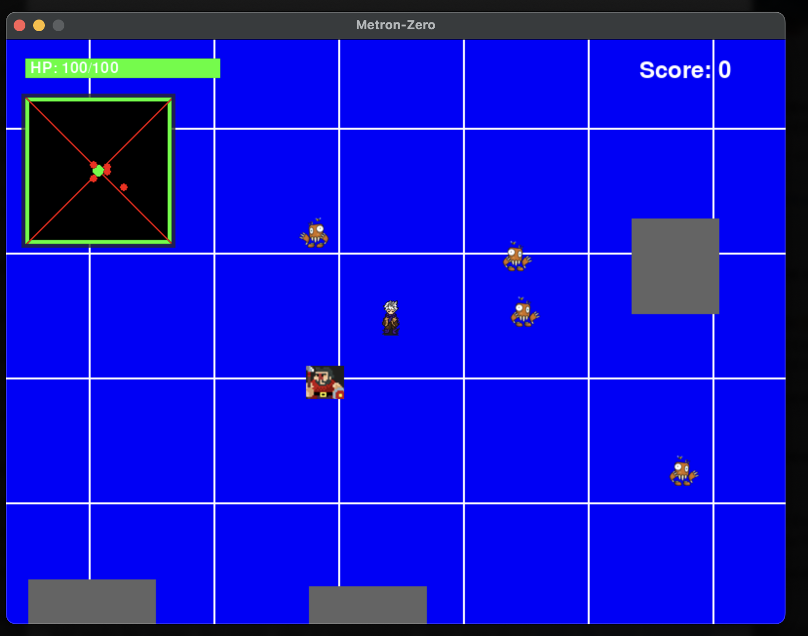
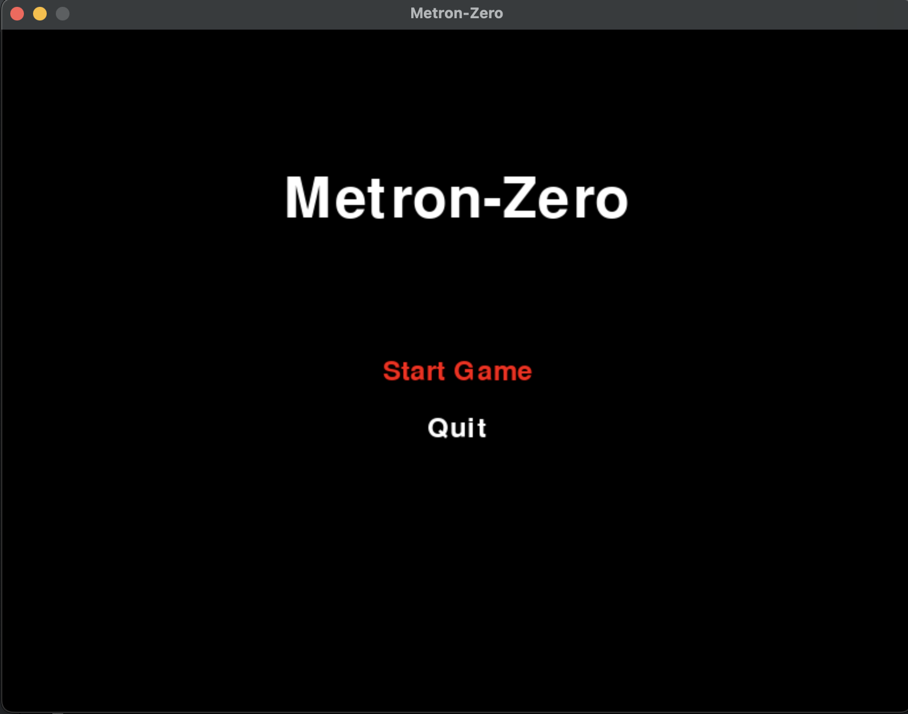
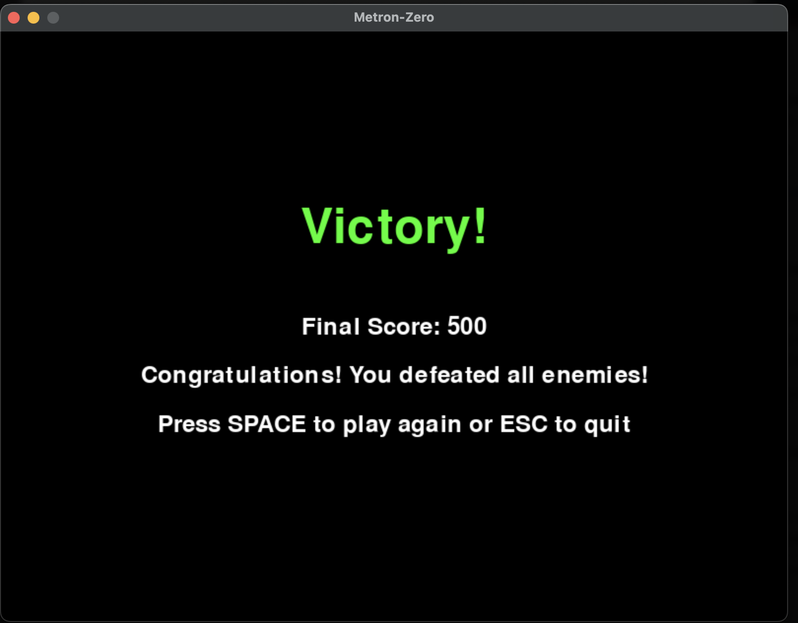

# Metron-Zero

* A 2D RPG game built with Pygame featuring dynamic combat, inventory system, and quest management.
* Developed on Mac OSX for Mac OSX





## Features

- Smooth player movement and combat
- Enemy AI with different behavior patterns
- Inventory system with item management
- Quest system with tracking
- Save/Load game functionality
- Multiple terrain types
- NPC interaction and shop system

## Installation

1. Clone the repository

```
git clone https://github.com/archmangler/metron-zero.git
```

2. Run the game from the shell

```
./load.sh
```

## Controls

- WASD/Arrow Keys: Move player
- SPACE: Attack
- E: Interact with NPCs
- I: Open/Close inventory
- ESC: Pause game
- F5: Quick save
- F9: Quick load

## Project Structure

├── assets/          # Game assets (images, sounds)
├── assets/ # Game assets (images, sounds)
├── src/ # Source code
├── saves/ # Save files
├── config.py # Game configuration
├── main.py # Entry point
└── requirements.txt # Python dependencies

## Development

- Python 3.8+
- Pygame 2.0.0+

## License

*The Unlicence*

